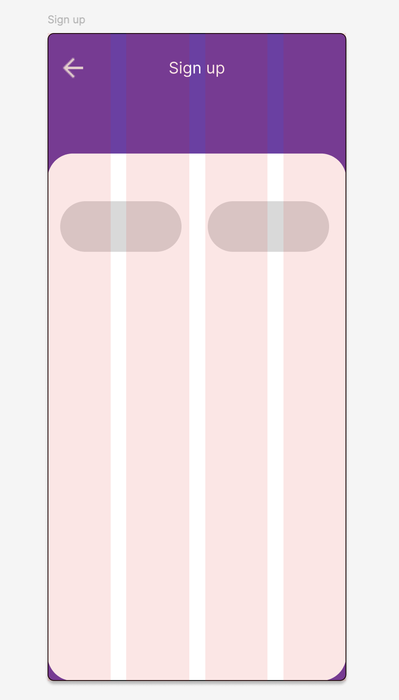

# Practica-Figma-Signup-UI-Challenge-1

1. Crea un frame de 319 de ancho (width) y 253 (alto) H, y el corner radius de 8.

Realizar por partes:

  * Crear dos Page: Page 1 y Page 2. 
1. Descargar los siguiente iconos adjuntos en la carpeta icons.
2. Arrastrar los iconos a la seccion layer(pagina en blanco). Ponerle al page assets/icons
3. Crear un componente de cada imagen. Al seleccionar la imagen en el menu del lado derecho, seleccionar crear componente.
4. Cambiar el color del frame a #713DA8.
5. crear otro frame de clor blanco con corner radius de 32 con H: 661 Y W: 375
6. Seleccionar el frame principal, ir al menu izquierdo y buscar layout guide, seleccioanr columnas y cambiar a 4.

Para los iconos: 

1. Crear un Reactangulo entre dos columnas, darle un border de 100, copiar y colocar otro mas entre las dos columnas. Quedaria asi:
   

Creacion de inputs:

1. Seleccionar el icono de user. Despues ponerle un texto para simular el input.
2. Selecciona el icono, presiona shift y despues selecciona el texto.
3. Copiar y pegar, usar el icono correspondiente y adecuarlo.

Boton:

1. Crear un rectangulo H: 56, W: 311 Y corener radius: 100
2. Colocar el texto crear cuenta
3. Cmabiar el color del background: #713DA8

